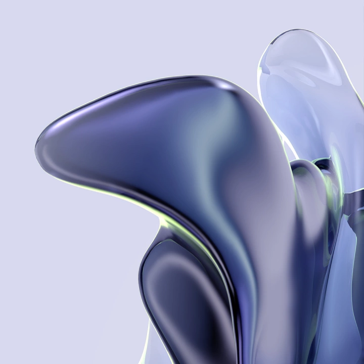
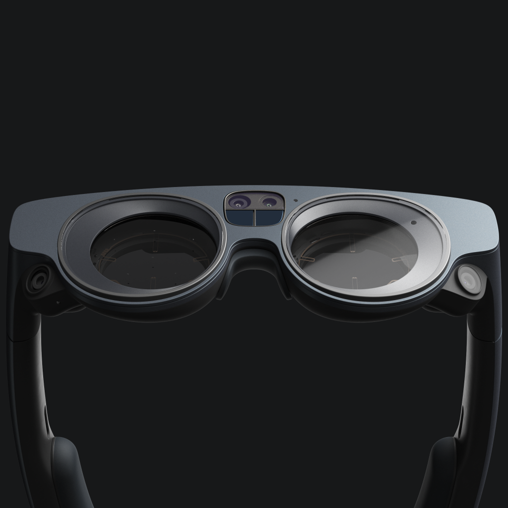
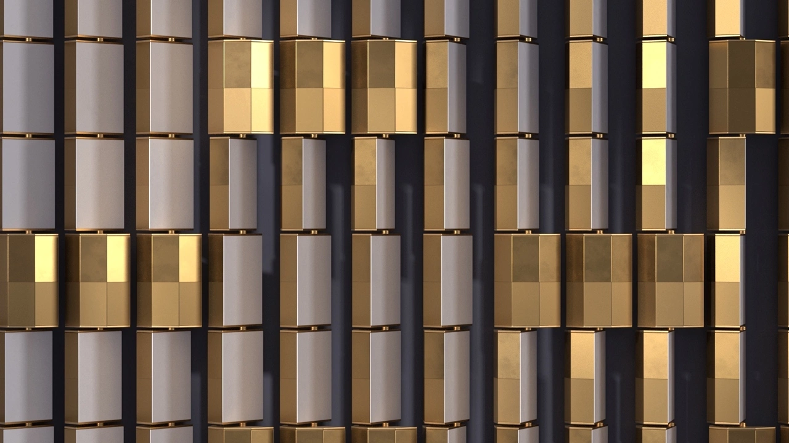
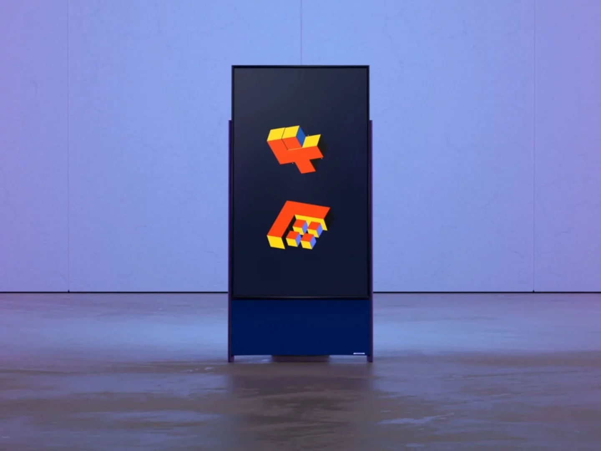
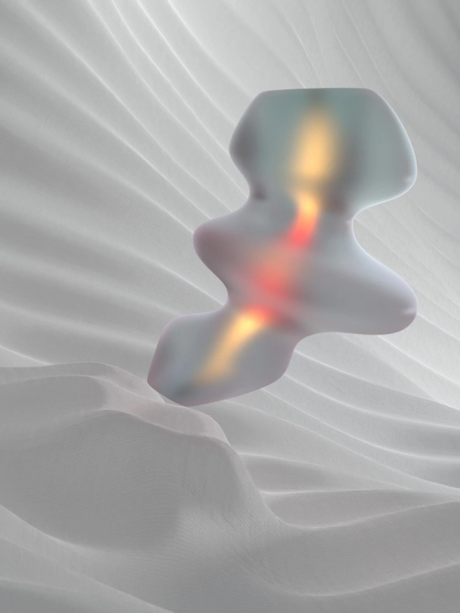

{}

{}

<a href="/projects/xiaomi-ks3k11r"><h5 style="text-align: right;">Xiaomi KS3 & K11R</h5></a>
{}



{}


<h5 style="text-align: right; color: lightgray;">Magic Leap (Soon)</h5>
{}

{}{}


{}
<a href="/projects/samsung-thewall">

<h5 style="text-align: right;">Samsung The Wall</h5></a>
{}


{}{}


{}
<a href="https://onformative.com/work/samsung-sero/" target="_blank">

<h5 style="text-align: right;">Samsung Sero</h5></a>
{}

{}{}

{}
<a href="/projects/sap-rebrand">

<h5 style="text-align: right;">Re:Brand</h5></a>
{}
{}

<a href="/projects/oneplus-8t">

<h5 style="text-align: right;">Live Wallpaper</h5></a>
{}

{}{}


{}
<a href="/projects/diageo">

<h5 style="text-align: right;">Lqd Crystllzd</h5></a>
{}


{}{}


{}
<a href="/projects/negroni">

<h5 style="text-align: right;">Blissheer</h5></a>
{}
{}

<a href="/projects/quiet-orography">

<h5 style="text-align: right;">Quiet Orography</h5></a>
{}


{}{}


{}
<a href="/projects/promotional-video">

<h5 style="text-align: right;">Promotional Video</h5></a>
{}


{}{}


{}
<a href="/projects/omada">

<h5 style="text-align: right;">Omada</h5></a>
{}


{}{}

{} <!-- Grid ends here -->
