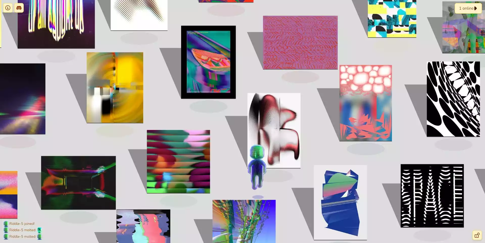

We went to the exposition Sound System Culture at Bethanien. Saw a noisy performance which almost destroyed our ears, but it was worth it.

Entered the rabbit hole of [Spencer Seim](https://en.wikipedia.org/wiki/Spencer_Seim) and I spent way too much time that I would admit looping at his [sBach](https://sbach.bandcamp.com/album/sbach) project.

I am also listening [Still House Plants](https://stillhouseplants.bandcamp.com/) quite a lot these days.

I dont remember how I ended up in this [LantentScape](https://latentscape.com/#0,-10) nor that I care. Please explain me what its about.

