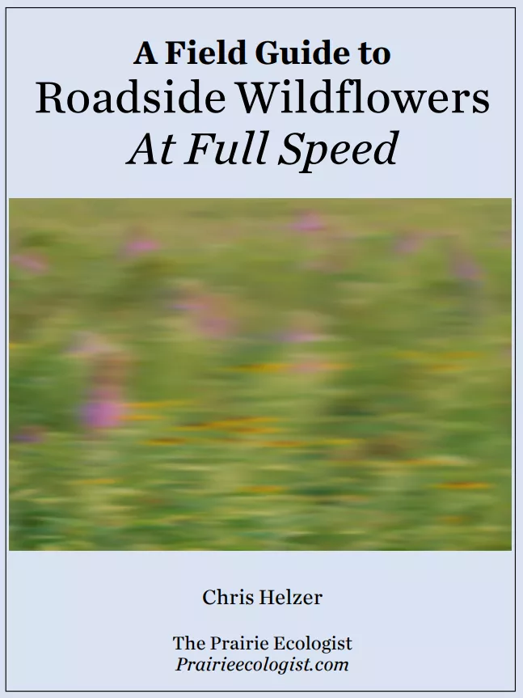

[A Field Guide to Roadside Wildflowers At Full Speed](https://prairieecologist.com/wp-content/uploads/2020/01/a-field-guide-to-roadside-wildflowers-at-full-speed_january2020-1.pdf) one of my favorite fanzines I’ve ever seen *onlinebecauseIhaveneverseenoutthere.*


Yet another place that collects weird and interesting sites made by humans: [Cloudhiker](https://cloudhiker.net/). If you still need more of these collections, I have a bunch more in my Digital Love section.


Cool portfolio in pastel tones, funny digital and physical projects with a total hack ethos, run into [the recreational software by Libbey White](https://friendola.com/)


[research as leisure activity](https://www.personalcanon.com/p/research-as-leisure-activity)


Really profound talk with Lorde accompanied by delicate photos by Martine Syms in [The magic lives close to the edge](https://www.documentjournal.com/2025/05/the-magic-lives-close-to-the-edge-lorde-and-artist-martine-syms-on-the-beauty-of-the-self/)

