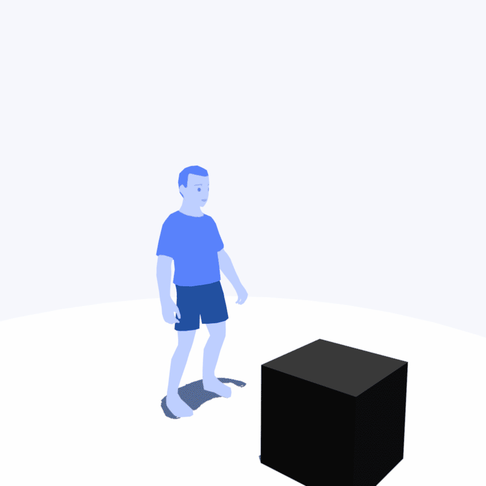
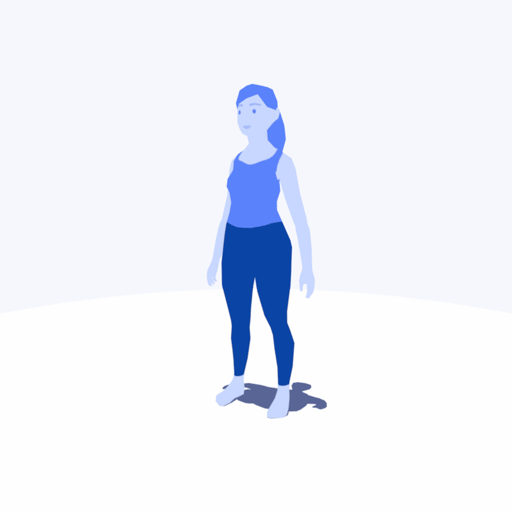

{}

I was part of the 3D team in charge of the developtment of the <a href="https://play.google.com/store/apps/details?id=com.healthcoda.physera&hl=de&pli=1">Joint & Muscle Health App</a> with guided exercises to reduce user pains. Mainly doing animations, a bit of rigging and a lot of back and forth at it early stages for correct implementation within ViroReact platform. Available now on the Apple Store and Google Play.

{}

{}

{}

{}

{}

{}

{}

{}

{}

{}

{}

{}

{}

{}

{}

{}
{}

{}
{}

{}
{}

{}
{}

{}
{}

{}
{}

{}

{}

{}
{}

{}

{}



{}
<h2>Credits</h2>

<strong><a href="https://www.omadahealth.com/">Omada</a></strong>

<strong>Art Direction </strong>Polygonal Mind 
<strong>Modeling </strong>A. Daniel G. 
<strong>Rigging and animation </strong>Diego S. Mezquiriz, Ricardo López. 
{}
