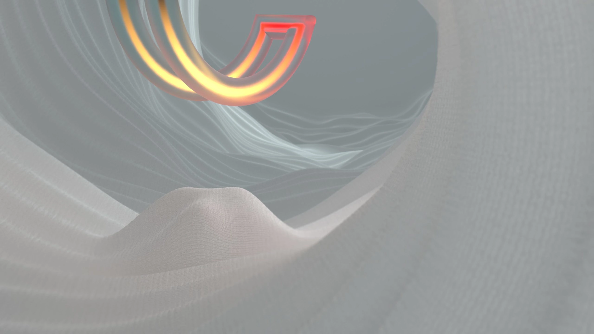
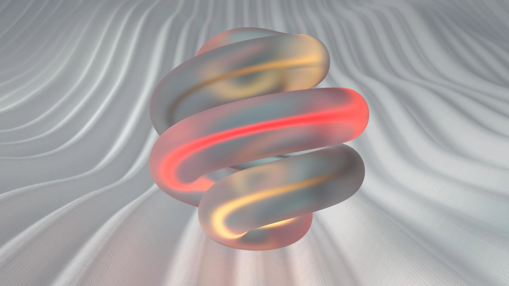
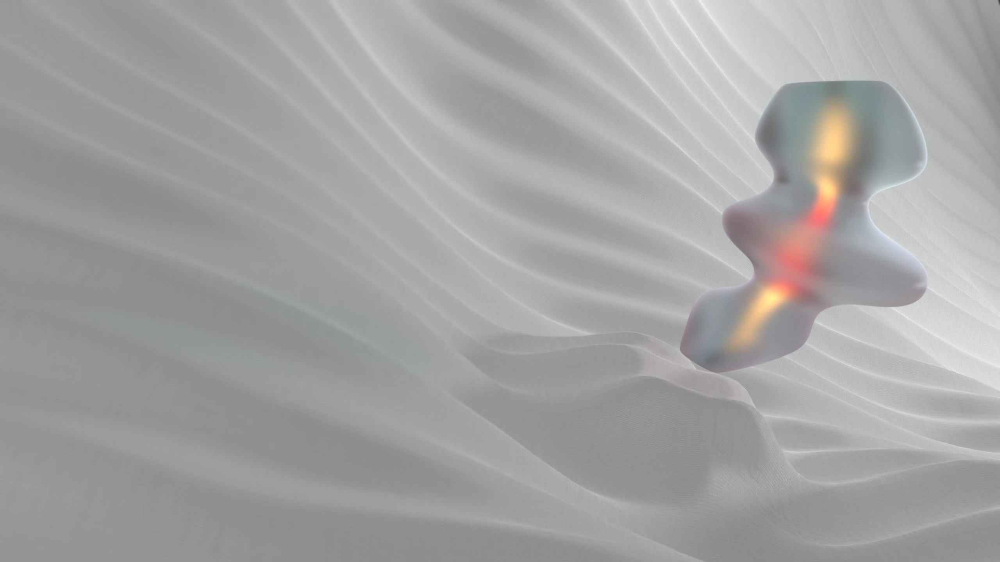

{}

How it would look without all the noise? An experiment in embracing simplicity over excitement and resisting the urge for instant gratification.

Navigating the unknown, daring to wander without a clear purpose, and allowing ourselves to momentarily let go of any expectations. In these moments of quiet reflection, we discover the value of being present, unburdened by the noise of the outside world (for a while).

{}

{}


{}

{}



{}

{}



{}

{}


{}

{}
{}

{}
{}

{}

{}

